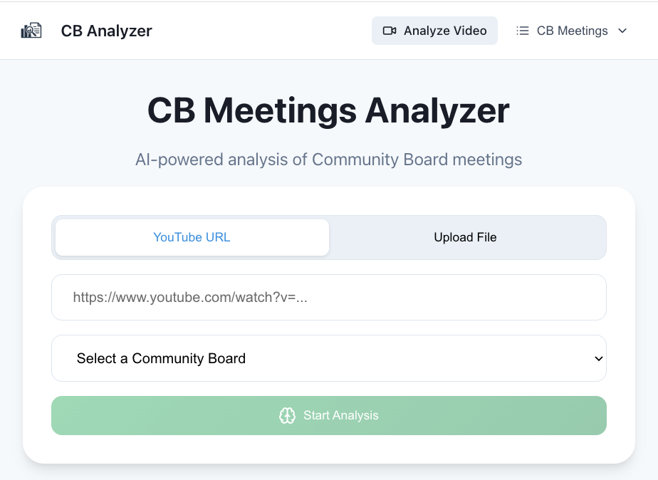
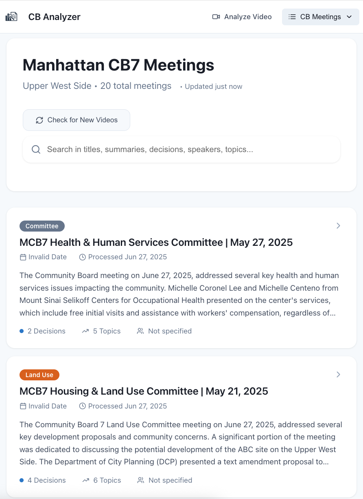
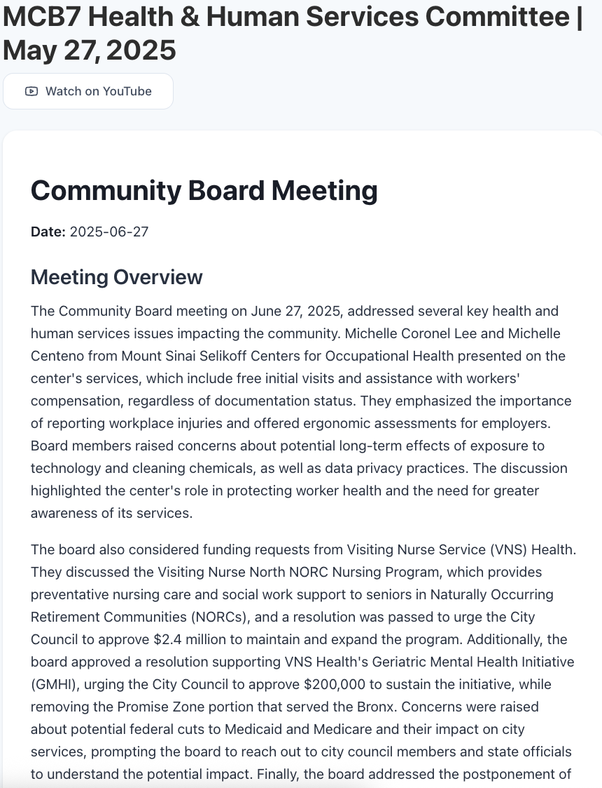

# cbmeetings

This app analyzes Manhattan Community Board meetings and turns them into quickly readable summaries
with key points and decisions.

## Technologies used

- Frontend: Typescript, React
- Backend: Python, Fast API, FFmpeg
- AI: OpenAI Whisper for Transcription, Gemini Flash 2.0 for Analysis
- Database: SQLite
